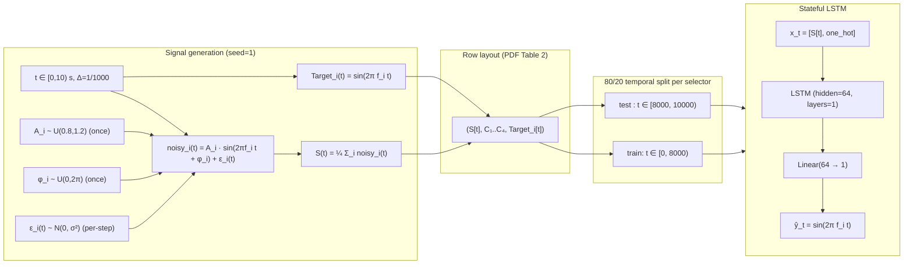

# Architecture — LSTM Frequency Extractor

## Signal-model note

A literal read of PDF §2.2 specifies `A_i(t)` and `φ_i(t)` drawn **per
timestep**. With per-timestep-uniform phase, `sin(2π f_i t + φ_i(t))` is
i.i.d. on the unit circle regardless of `t`, so `S[t]` contains **zero**
information about either `t` or `f_i` and the LSTM converges to the mean
predictor (MSE ≈ `Var(sin) = 0.5`). This project therefore uses the
standard noisy-sinusoid interpretation:

- `A_i ~ U(0.8, 1.2)` and `φ_i ~ U(0, 2π)` are drawn **once per
  realisation** (one value per frequency, kept constant over `t`).
- Additive Gaussian noise `ε_i(t) ~ N(0, σ²)` (`σ = 0.1`) is added per
  timestep — this is the per-sample variability the PDF calls "noise".

`noisy_i(t) = A_i · sin(2π f_i t + φ_i) + ε_i(t)`.

## Data flow

## Model specification

| Component | Value |
|-----------|-------|
| Framework | PyTorch |
| Module    | `torch.nn.LSTM` |
| Input size  | 5 (1 scalar signal + one-hot of length 4) |
| Hidden size | 128 |
| Num layers  | 1 |
| Batch first | yes |
| Head        | `nn.Linear(64, 1)` |
| Loss        | `nn.MSELoss` |
| Optimizer   | Adam, lr 1e-3 |
| Epochs      | 60 (early stopping, patience 8) |

## Training stream and state management

Within each epoch:

1. Initialise `(h, c) = 0` with `batch_size = 4` (one row per selector).
2. Walk the 8 000-step training block in non-overlapping windows of length
   `L`. For each window:
   - Forward pass → compute MSE over the window.
   - Backpropagate through **the window only** (truncated BPTT).
   - `h.detach_(); c.detach_()` — state persists, graph does not.
3. Evaluation uses a **warm-up** pass: stream the training block under
   `no_grad()` to rebuild `(h, c)`, then continue into the 2 000-step test
   block from that warm state. Without warm-up the model starts cold at
   `t = 8.0 s` and under-predicts amplitude for hundreds of samples.

## Reset policy

| Situation                        | Reset? | Why |
|----------------------------------|:-----: |-----|
| Between timesteps, same selector |  No    | Stateful temporal learning. |
| Between L-length windows         |  No (detach only) | Truncated BPTT. |
| Between selectors / epochs       |  Yes   | New conditioning context; new epoch. |
| Train → test transition          |  Yes   | Evaluate from a fresh state. |

## Metrics

- Train MSE:
  `MSE_train = 1/32000 · Σ_{t ∈ train} (LSTM(S[t], C) − Target[t])²`
- Test MSE:
  `MSE_test  = 1/8000  · Σ_{t ∈ test}  (LSTM(S[t], C) − Target[t])²`
- Generalisation check: `MSE_test ≈ MSE_train` ⇒ the model has learned the
  underlying sinusoid rather than noise realisations.
