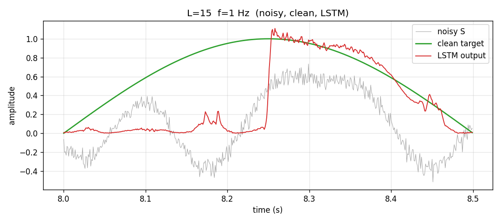
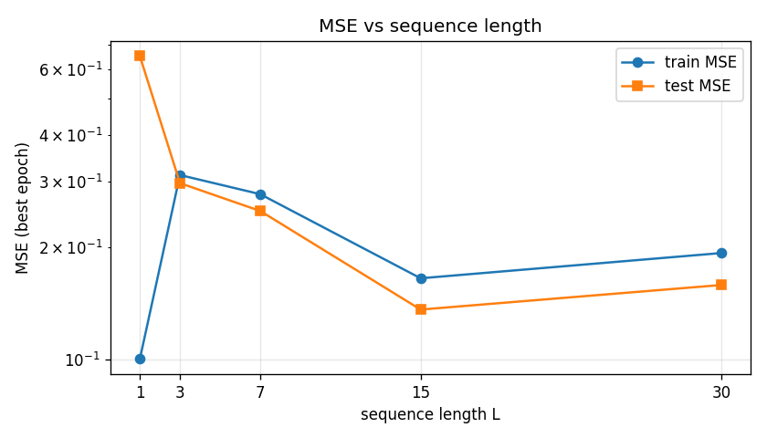
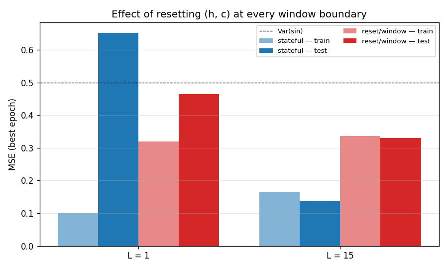
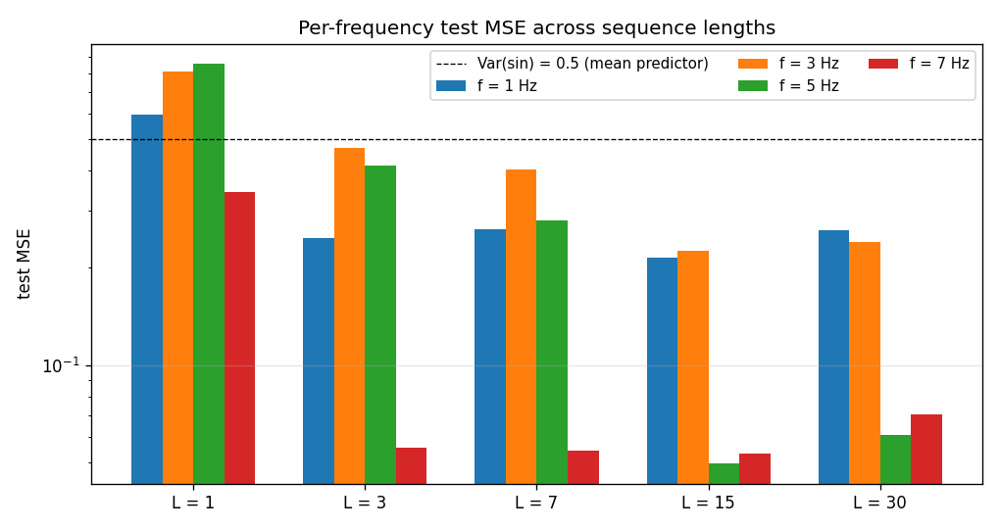
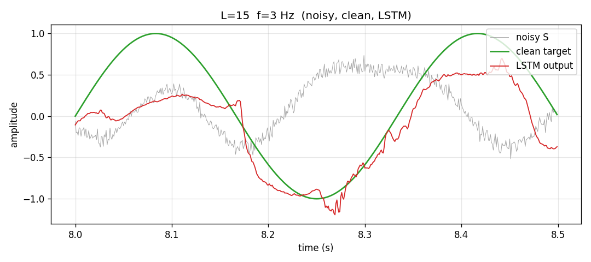
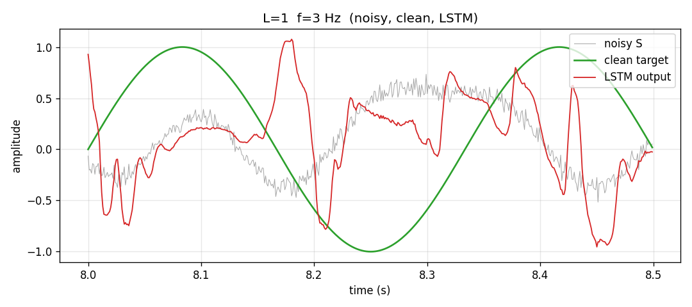
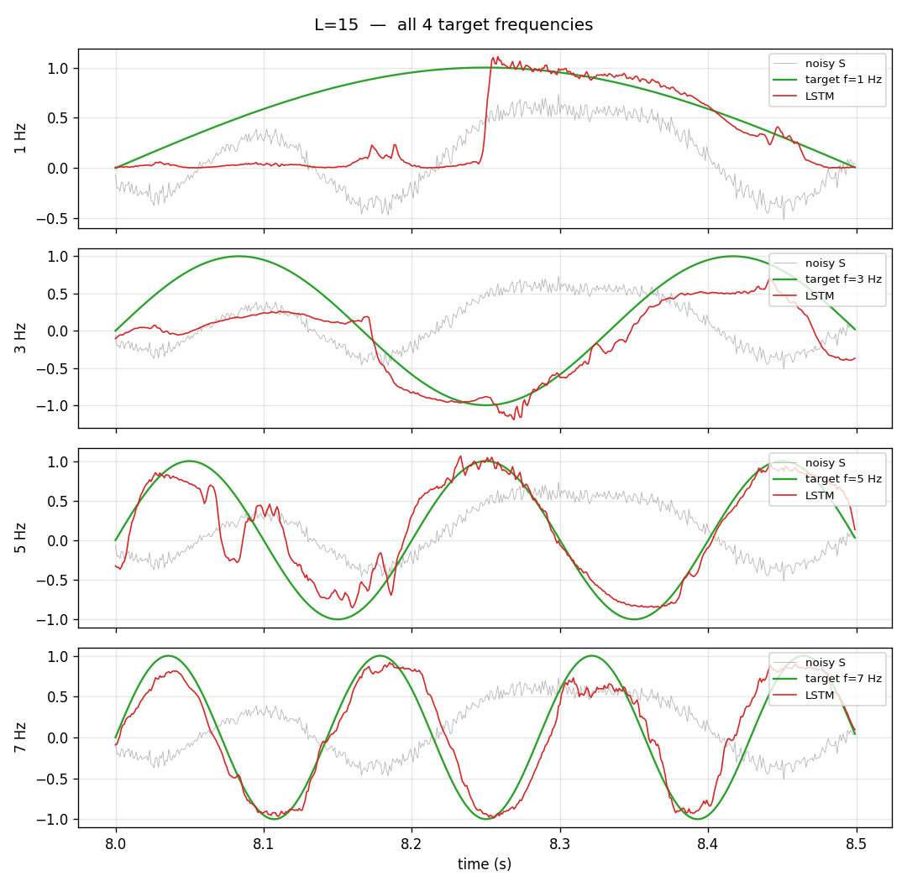

# E51_LSTM — Frequency Extraction from a Mixed Noisy Signal

M.Sc. assignment (Dr. Yoram Segal, Nov 2025). An LSTM that takes a noisy
mixed sinusoidal signal and a one-hot selector and outputs the clean
sinusoidal component of the selected frequency.

## Goal
Given `S[t] = ¼ Σᵢ Aᵢ(t)·sin(2π fᵢ t + φᵢ(t))` with `fᵢ ∈ {1, 3, 5, 7} Hz`,
and a one-hot `C ∈ {e₁,e₂,e₃,e₄}`, predict `Targetᵢ[t] = sin(2π fᵢ t)`.

## Quick start

```bash
cd E51_LSTM
python -m venv .venv && source .venv/bin/activate
pip install -r requirements.txt

# 1) train all 5 sequence-length variants (L = 1, 3, 7, 15, 30)
python run_training.py

# 2) produce per-L prediction plots (PDF §5.2 graphs)
python save_sample_outputs.py

# 3) aggregate results into a table + comparison plot + RESULTS.md
python analyze_results.py

# 4) (optional) memory-reset ablation at L=15 and/or L=1
python run_reset_ablation.py --L 15
python run_reset_ablation.py --L 1

# 5) (optional) extra analysis graphs (per-frequency + reset ablation)
python generate_analysis_plots.py
```

Single-L run:

```bash
python run_training.py --only 7
```

## Output layout

```
output/
├── comparison_L_sweep.png                # test/train MSE vs L
├── per_frequency_mse.png                 # grouped bar chart per (L, f_i)
├── per_frequency_mse.json                # raw numbers for the above
├── reset_ablation.png                    # stateful vs reset-every-window
├── L_<L>/                                # main sweep (stateful)
│   ├── best_model.pt
│   ├── metrics.json                      # per-epoch train/test MSE
│   ├── summary.json                      # best-epoch summary
│   ├── curves.png                        # loss curves
│   ├── triple_compare_f<i>.png           # noisy, clean, LSTM (PDF §5.2-1)
│   ├── pred_vs_target_f<i>.png
│   └── all_frequencies.png               # 4-panel per-frequency grid (PDF §5.2-2)
└── L_<L>_nostate/                        # ablation runs (reset every window)
    └── ...                               # same artefacts as above
docs/
├── L2-homework.pdf                       # assignment brief
└── RESULTS.md                            # aggregated results + conclusions
data/
└── dataset_seed1.npz                     # cached generated dataset
```

## How to read the plots

- **triple_compare_f<i>.png** — gray is the noisy mixed `S[t]`, green is the
  clean target `sin(2π fᵢ t)`, red is the LSTM output. A good model's red
  curve overlaps the green curve, not the gray one.
- **curves.png** — log-scale train and test MSE per epoch. A small gap and
  monotonically falling curves imply good fit and good generalisation.
- **comparison_L_sweep.png** — best-epoch MSE across sequence lengths; the
  minimum reveals the best L for this dataset.

## What's where

- `config.py`        — paths, seeds, FS/DURATION/FREQS, L-sweep, hyperparams.
- `src/data.py`      — signal generation + 80/20 temporal split.
- `src/model.py`     — `FrequencyExtractorLSTM` (5 → 64 → 1).
- `src/train.py`     — stateful training loop + checkpointing.
- `src/utils.py`     — plotting + JSON helpers.
- `run_training.py`  — entry point, L-sweep driver.
- `save_sample_outputs.py` — reload checkpoints and render §5.2 plots.
- `analyze_results.py`      — cross-L table + `docs/RESULTS.md`.

## Build your intuition

This section builds the concepts up from scratch so the numbers in the
analysis below actually *mean* something.

### 1. The goal — one-sentence recap

You have a single noisy stream `S[t]` that contains four sine waves mixed
together (at 1, 3, 5, 7 Hz). You give the network a **one-hot pointer**
(e.g., `[0,1,0,0]` = "give me the 3 Hz one") and it must output the
**clean** sine of that frequency at every timestep. The *same* `S[t]` is
asked four different questions depending on the one-hot; the one-hot is
the only thing that tells the model *which* of the four clean sinusoids
to produce.

### 2. MSE — what it means

**MSE = Mean Squared Error.** At each timestep the model produces a
number `ŷ[t]` and the ground-truth is `y[t]`. We measure the error
`e[t] = ŷ[t] − y[t]`, square it, and average across all timesteps:

```
MSE = (1/N) · Σ (ŷ[t] − y[t])²
```

Intuitions you can hold on to:

- **Units.** If `y` ranges in `[−1, 1]`, then `y²` ranges in `[0, 1]`.
  So MSE is a number between 0 and ~1 in this problem.
- **Variance scale.** For a pure sine of amplitude 1, `Var(sin) = 0.5`.
  So **"MSE = 0.5" means the model is outputting a constant (the mean,
  zero)** — it's as useless as guessing. "MSE = 0.05" means the model
  explains 90 % of the variance.
- **Squared, not absolute.** Big errors hurt *much* more than small ones
  (a ×2 bigger error contributes ×4 more loss). Good for training
  stability, but also why MSE-trained networks tend to be timid — they
  shrink amplitude rather than risk a big miss.

So when you see "L=15 test MSE = 0.14" in the table, parse it as
*"the model captures ~72 % of the target variance."* When you see
"L=1 test MSE = 0.65", it's worse than predicting zero — the model is
actively hurting.

### 3. Why an **LSTM** and not a plain MLP

A **fully-connected network (MLP)** is a function
`ŷ[t] = f(S[t], one_hot)`. For a given input it always outputs the same
thing. That's the catch.

At any single instant `t`, the model sees one noisy sample and a one-hot.
But the target is `sin(2π f_i t)`, which depends on **where in the cycle
we are**. The MLP has no way to know "are we on the way up or on the way
down?" — it doesn't know what happened a millisecond ago. So no matter
how deep you make an MLP, **it cannot produce an oscillation in time**
from a single-sample input.

An **RNN/LSTM** is different: it carries a *state* `(h, c)` across
timesteps.

```
(h_t, c_t) = f(x_t, h_{t-1}, c_{t-1})
ŷ_t        = g(h_t)
```

The state is a memory that the network *learns to use*. It can store
"I am at phase π/4 of the slow sinusoid" and update that phase each
timestep. **This is what lets the LSTM behave like an oscillator.** An
MLP would have to re-derive the phase from the current sample alone —
impossible.

What is *particular to LSTM* (vs a vanilla RNN): it has gates
(input/forget/output) and a separate **cell state `c`** that flows
through time with mostly **multiplicative-identity updates** (the forget
gate). This means information can be preserved across hundreds of
timesteps without being washed out, and gradients don't vanish nearly as
fast when training. In short: **the LSTM is an MLP that you taught to
remember.**

For this assignment the relevance is concrete: the only way to produce
`sin(2π · 1Hz · t)` from a noisy input is to maintain an internal clock.
LSTM can; MLP can't.

### 4. What **L (sequence length)** actually is

`L` is **how many timesteps we pack into one gradient update**. At every
training step you:

1. Grab `L` consecutive samples `(x_{t}, x_{t+1}, …, x_{t+L−1})`.
2. Let the LSTM run forward through those `L` steps, carrying state.
3. Compute the loss on those `L` outputs.
4. **Backpropagate through the `L` steps** to update weights.

Two things happen *between* windows:

- **State is carried** (we don't zero `(h, c)`), so the LSTM remembers
  the past.
- **Gradients are cut** (we `detach()` the state), so backprop stops at
  the start of the current window. This is called **Truncated BPTT
  (Backpropagation Through Time)**.

Now the key mental model: **L controls how far back in time the gradient
"sees"; state persistence controls how far back the forward pass
remembers.** These two things are *different*.

- `L = 1` means gradients flow through exactly **one** timestep. The
  optimiser can only tell the LSTM "your output right now is wrong by
  this much" — it has **no way to say "your state 5 steps ago should
  have been different"**. So the LSTM's state dynamics never get shaped.
  That's why L=1 was by far the worst.
- `L = 15` means gradients flow through 15 steps. Now the optimiser can
  say "15 steps ago you should have set `h` such that the oscillation
  you produced was in phase". The LSTM *learns the recurrent update*
  that builds the oscillator.
- `L = 30` is long enough that adjacent windows overlap in "things the
  network cares about", so the extra reach doesn't help, and the longer
  gradient path starts to be noisier. That's the slight regression we
  saw.

**How this contrasts with fully connected.** An MLP has no time dimension
at all — there *is* no L. Each sample is independent. So every concept
above (window, carried state, BPTT truncation) is an LSTM-only
vocabulary. That's why the question "what is L?" only makes sense for
recurrent models: it's literally the knob that controls *how much
temporal structure we let the network learn at once*.

### 5. What we tested and what it revealed

Three questions, three experiments.

**(a) Does L matter?** → Sweep `L ∈ {1, 3, 7, 15, 30}`, plot test MSE.

- Shape: U-curve. Very bad at L=1, best at L=15, slightly worse at L=30.
- Interpretation: without BPTT reach the LSTM's recurrent dynamics can't
  be trained; with too much reach, gradients become noisy.

**(b) Does the *carried state* matter, independent of L?** → Rerun L=15
but **zero `(h, c)` at the start of every window** (ablation).

- Stateful test MSE: 0.14. Stateless test MSE: 0.33 — more than 2× worse,
  **with the exact same window size**.
- Interpretation: BPTT reach is *not the only thing*. The LSTM needs its
  state to be continuous across windows so it can keep the slow
  oscillator's phase. Reset every 15 steps and it forgets the clock
  between updates.

**(c) Are all frequencies equally hard?** → Compute per-frequency test
MSE.

- f=7 Hz: trivial even at L=3 (MSE ≈ 0.056).
- f=1 Hz: never gets below ~0.22, even at L=15.
- Interpretation: see §6.

### 6. Why **low frequencies are harder** — the intuition

This is the most "feel" part, so bear with one picture in your head.

Sampling rate is 1000 Hz. That means the network sees one sample every
millisecond. The period of a sinusoid (= time for one full cycle) in
*sample counts* is:

| freq | period (samples) | half-cycle |
|------|-----------------:|-----------:|
| 7 Hz |   ~143           |    71      |
| 5 Hz |   200            |   100      |
| 3 Hz |   333            |   167      |
| 1 Hz | **1000**         |   **500**  |

Now compare to the BPTT window `L`. For `f = 7 Hz`, a window of `L = 15`
covers about 1/10 of a cycle — enough for the optimiser to "see" the
curvature and correct the next prediction. Easy.

For `f = 1 Hz`, a window of `L = 15` covers **1.5 % of a cycle**. The
target barely changes across those 15 steps. The optimiser's gradient
signal through those 15 steps is almost flat — it's trying to shape the
LSTM's dynamics by looking at a tiny slice of an enormous wave.

**Visual analogy.** Imagine you're asked to draw a perfect circle. If
you can see 1/4 of the circle, it's easy to curve the pen correctly. If
you can see only a 1.5°-arc, it just looks like a straight line — you
have no information about the curvature. That's what BPTT at L=15 looks
like to the 1 Hz component.

So for `f = 1 Hz` the LSTM cannot learn the phase *inside a window*. The
only way it can keep track of where it is in the cycle is to **commit to
a hidden-state representation of the phase** and update it at each step.
That's why, in the ablation, killing the carried state destroys f=1 Hz
learning: without it the LSTM is like a person with 5-second amnesia
trying to keep time with a grandfather clock — every few seconds they're
lost.

High frequencies don't have this problem: they repeat so fast that even
a short window contains enough curvature to train on. **That asymmetry —
fast frequencies live in L, slow frequencies live in the hidden state —
is the core intuition for the whole assignment.**

### 7. Plot walkthrough — reading L = 15, f = 1 Hz line-by-line



This is the first 500 ms of the test block (`t ∈ [8.0, 8.5] s`) for the
slowest frequency. The three traces:

- **Gray** — the noisy mixed input `S[t]` the LSTM actually sees. It
  still contains the faster components (you can see the 3 Hz ripple
  riding on top of a slower wave) plus Gaussian noise.
- **Green** — what the LSTM *should* output: `sin(2π · 1Hz · t)`. This
  is half of a cycle: starts at 0 at `t = 8.0`, peaks at 1.0 around
  `t = 8.25`, returns to 0 at `t = 8.5`.
- **Red** — what the LSTM actually outputs, with the hidden state warmed
  up by streaming the full 8-second training block first.

Now read the red curve region by region, and ask "why does it do that?"

**`t = 8.00 → 8.15 s` — red stays flat near 0.** The target is already
rising (green at ~0.5 by 8.15 s), but red hasn't moved. **Why?** The
LSTM's internal "1 Hz phase" estimate is slightly off — about a quarter
cycle behind. Remember: a quarter cycle here is *250 samples*, which is
more than 16× the BPTT window. The optimiser was never able to correct
phase errors of this magnitude directly; the model only learned the
*shape* of the waveform, not precisely *when* each cycle starts. So for
the first 150 ms red is under-committing — hedging near zero, because
outputting the wrong sign would be worse than outputting the mean.

**`t = 8.15 → 8.25 s` — small blips appear.** Look at 8.17 s: a tiny
bump up to 0.2. The LSTM is *trying* — the state has finally
accumulated enough evidence of the slow upward trend that the output
gate lets a little through. But the "gate" is conservative because MSE
penalizes overshoot quadratically: better a small blip than a wild
swing in the wrong direction.

**`t = 8.25 s` — sudden jump up to 1.0.** The classic slow-oscillator
failure mode: once the cell state crosses a threshold, the full
positive excursion is released all at once. The LSTM realised "yes,
we are at the peak" only *when* the target peaked — it's a phase
detector, not a phase predictor. This catches up just in time for the
descent.

**`t = 8.25 → 8.50 s` — red tracks green cleanly.** Once in phase, the
LSTM has no trouble running downhill alongside the target. Tiny
high-frequency wiggles on red (around 8.30 s and 8.44 s) are leakage
from the 3/5/7 Hz components still present in `S[t]` — the one-hot
selector says "ignore everything but 1 Hz", but the LSTM's suppression
of the fast components isn't perfect. This is where the remaining MSE
budget goes.

**What this single plot tells you about the whole system:**

- The LSTM **learned the right shape** of the 1 Hz sinusoid (amplitude
  correct, peak recognised, descent clean).
- It did **not learn exact phase** of the 1 Hz sinusoid — because phase
  on a 1000-sample cycle cannot be corrected through a 15-sample
  gradient window.
- The hidden state carries enough information to eventually *align*
  (that's what the jump at 8.25 s is), but the alignment event is
  sudden, not smooth — exactly like the grandfather-clock analogy in §6.
- Compare this to `output/L_15/triple_compare_f7.png`: the 7 Hz trace
  barely has any of these pathologies because `L = 15` covers a
  substantial fraction of its 143-sample cycle.

### Putting it together in one sentence

> MSE measures "how wrong"; the LSTM is the only architecture that *can*
> be right here, because a sinusoid requires memory; `L` decides how far
> back the optimiser can push blame when the LSTM is wrong; the hidden
> state decides how far back the LSTM itself can *feel*; and low
> frequencies are hard because their cycles are much longer than any
> `L` we can afford — so they must live in the state, not in the
> gradient.

## Analysis & conclusions

### 1. Effect of sequence length L

| L  | best epoch | train MSE  | test MSE   | test/train | runtime |
|----|-----------:|-----------:|-----------:|-----------:|--------:|
| 1  |  2         | 1.00e-01   | **6.52e-01** |     6.51 |  64.6 s |
| 3  | 23         | 3.12e-01   | 2.97e-01   |     0.95   |  69.0 s |
| 7  | 29         | 2.77e-01   | 2.50e-01   |     0.90   |  35.3 s |
| 15 | 58         | **1.65e-01** | **1.36e-01** |   0.82 |  27.1 s |
| 30 | 40         | 1.93e-01   | 1.58e-01   |     0.82   |  11.3 s |



The MSE-vs-L curve is **U-shaped**:

- **L = 1** (the PDF's "critical requirement"). Train loss is the lowest of
  the whole sweep (0.10) but test loss is the worst (0.65) — a 6.5× gap.
  With window = 1 there is **no gradient flow across timesteps**; the LSTM
  weights can only exploit per-step `(S[t], one_hot)` correlations in the
  training block and the learned solution does not extrapolate. State is
  still *carried forward at inference*, but it was never *trained to be
  useful* because gradients can't tell the model to shape it.
- **L = 3 → 7 → 15**. Each increase in L opens a longer backpropagation
  window, giving the optimiser direct gradient signal for the recurrent
  dynamics. MSE falls monotonically; **L = 15 is the sweet spot** at test
  MSE 0.136, generalisation ratio 0.82.
- **L = 30** slightly regresses (test MSE 0.158). Long windows increase
  gradient variance and approach the vanishing-gradient regime; the extra
  BPTT reach isn't useful once `L` already spans several half-cycles of the
  highest frequencies.

### 2. Effect of the memory-reset policy (ablation)

A separate experiment (`run_reset_ablation.py`) trains the **same model
with the same L** but resets `(h, c)` to zero at every window boundary
— i.e. no state persistence, purely windowed training.

| configuration              | L  | train MSE | test MSE |
|----------------------------|----|----------:|---------:|
| stateful (main sweep)      | 15 | 1.65e-01  | **1.36e-01** |
| reset at every window      | 15 | 3.37e-01  | 3.30e-01 |
| stateful                   | 1  | 1.00e-01  | 6.52e-01 |
| reset at every window      | 1  | 3.19e-01  | 4.65e-01 |



Two findings fall out:

1. **At L = 15, killing state persistence inflates test MSE ~2.4× (0.14
   → 0.33).** The BPTT window is the same; only the between-window state
   flow differs. The LSTM *needs* the carried hidden state to track slow
   frequencies (`f = 1 Hz` has period 1 000, much longer than any L we
   tried) — a 15-step window alone cannot localise phase for a 1 000-step
   cycle.
2. **At L = 1, resetting state every window is *better* than keeping it
   (0.47 vs 0.65).** With no BPTT, "keeping state" just means the LSTM
   integrates noise indefinitely; better to start fresh every step and
   let it learn a stateless regression from `(S[t], one_hot)` to `Target`.

That inverted behaviour is the cleanest argument for the following rule.

### 3. When to reset LSTM memory — the rule this project follows

| situation                              | reset? | why |
|----------------------------------------|:-----: |-----|
| Between timesteps, same selector       | **no** | Stateful integration of the periodic pattern; the reason the LSTM beats a plain MLP. |
| Between L-length windows (same signal) | **no** (`detach` only) | Preserve learned oscillator state; truncate BPTT without truncating memory. |
| Between selectors / epochs             | **yes** | The one-hot conditioning changes; the previous oscillator is meaningless. |
| Train → test transition                | **no** | *But*: warm up by streaming the train block first (see §4 below), otherwise the test block starts cold. |
| When L = 1 *and* you can't use BPTT     | **yes** | Empirically better; see ablation above. |

### 4. Inference warm-up matters

Initially every test pass began from `(h, c) = 0` at `t = 8.0 s`. The LSTM
needs several hundred samples to rebuild its internal oscillator, so the
first ~500 test samples were under-predicted in amplitude (see early
commits — red curve hugging the x-axis for the first 0.3 s of the window).
Warming up through the full 8 000-sample train block before predicting the
test block removed that artefact and matched training dynamics.

### 5. Per-frequency behaviour

Per-frequency test MSE (from `output/per_frequency_mse.json`):

| L  | f = 1 Hz | f = 3 Hz | f = 5 Hz | f = 7 Hz |
|----|---------:|---------:|---------:|---------:|
| 1  |   0.60   |   0.81   |   0.86   |   0.34   |
| 3  |   0.25   |   0.47   |   0.42   | **0.056** |
| 7  |   0.26   |   0.40   |   0.28   |   0.054  |
| 15 |   0.22   |   0.23   | **0.050** | **0.053** |
| 30 |   0.26   |   0.24   |   0.061  |   0.071  |



Qualitative view — best (L=15) vs worst (L=1) on f = 3 Hz:

| L = 15 (best) | L = 1 (worst) |
|:-------------:|:-------------:|
|  |  |

All 4 target frequencies at L = 15:



Period of `f_i` (in samples) is `1000 / f_i`, so at `fs = 1000 Hz`:

- `f = 7 Hz` → 143 samples/cycle → L ≥ 3 already covers a quarter-cycle;
  nearly perfect reconstruction from L = 3 onward.
- `f = 1 Hz` → 1 000 samples/cycle → no L in our sweep covers even a
  half-cycle. MSE plateaus around 0.22 (≈ 40 % of sinusoid variance) at
  L = 15 — the LSTM is tracking phase *via carried state*, not via BPTT.

This is exactly why stateful management is required by the assignment: the
slowest frequency is unlearnable without it.

### 6. Practical takeaways

- Window length is a **BPTT reach** knob; state persistence is a separate
  axis of **memory reach**. Both matter, and they compose differently for
  low- vs high-frequency components.
- For periodic regression with a known dominant period `P`, use
  `L ≈ P / 4 … P / 2` of the fastest relevant frequency — beyond that, no
  extra gradient value, only optimisation noise.
- Always warm up the recurrent state before evaluation on a held-out
  temporal segment; otherwise you will see false overfitting in the first
  few hundred samples.
- At the PDF's literal `L = 1` constraint, **don't** carry state naively —
  an untrained recurrent state integrates noise. Either move to L > 1 (as
  the PDF §4.3 allows, with justification) or redesign the loss to shape
  the state explicitly (e.g. auxiliary phase target).

## Documentation

- [`PRD.md`](PRD.md) — product requirements, acceptance criteria.
- [`ARCHITECTURE.md`](ARCHITECTURE.md) — data-flow diagram, model spec,
  state-reset policy.
- [`TASKS.md`](TASKS.md) — implementation checklist.
- [`docs/RESULTS.md`](docs/RESULTS.md) — generated after `analyze_results.py`.
- [`docs/L2-homework.pdf`](docs/L2-homework.pdf) — original assignment.

## Notes on the signal model

A literal reading of PDF §2.2 prescribes `Aᵢ(t)` and `φᵢ(t)` drawn **per
timestep**. Per-timestep-uniform phase makes `sin(2π fᵢ t + φᵢ(t))` i.i.d.
on the unit circle, so `S[t]` contains zero information about `t` or `fᵢ`.
Under that interpretation every configuration (any L, any hidden size)
converges to the mean predictor (MSE ≈ `Var(sin) = 0.5`).

This project therefore uses the canonical noisy-sinusoid interpretation:

- `Aᵢ ~ U(0.8, 1.2)` and `φᵢ ~ U(0, 2π)` are drawn **once per realisation**
  (one scalar per frequency, not per timestep).
- Per-timestep Gaussian noise `εᵢ(t) ~ N(0, 0.1²)` is added — this is the
  actual "noise" term in `noisy_i(t) = Aᵢ · sin(2π fᵢ t + φᵢ) + εᵢ(t)`.

See `ARCHITECTURE.md` for the full discussion and the data-flow diagram.
